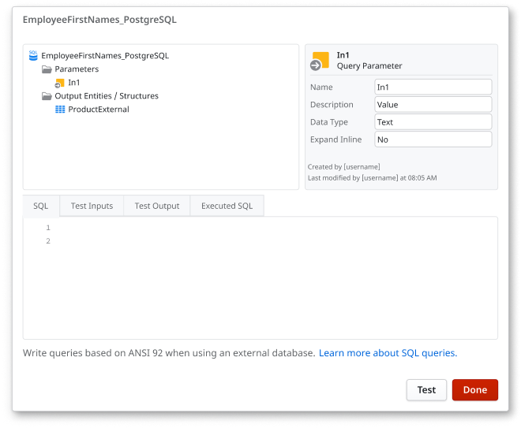

# Query data using SQL

In OutSystems Developer Cloud (ODC), developers primarily use **Aggregates** for data retrieval and manipulation due to their simplicity and platform optimizations. However, there are scenarios where **SQL** queries become essential for implementing complex data operations.

A SQL node allows developers to write custom SQL queries directly within OutSystems applications. This capability is particularly useful when dealing with complex queries that are challenging to construct using Aggregates. With SQL nodes, developers can execute advanced database operations, such as intricate joins, subqueries, and database-specific functions.

## SQL syntax types

OutSystems supports two SQL syntaxes within SQL nodes:

* [PostgreSQL syntax](../../../../onboarding/differences-sql.md) is used when the query includes only internal entities (created in ODC Studio).

* ANSI-92 syntax is used when the query includes external entities, or a mix of internal and external entities.



ODC Studio automatically determines which syntax to use based on the entities referenced in your query. You can’t select or configure the syntax manually.

## Where SQL nodes can be used

You can use SQL nodes in server-side flows, including:

* **Server actions**

* **Service actions**

* **Screen data actions**

This flexibility allows you to reuse SQL logic in different layers of your application.

You can also test SQL queries directly in ODC Studio. This helps you validate the query and preview the results before using them in your logic.

<div class="warning" markdown="1">

When querying external entities, avoid using Test Query in ODC Studio for SQL nodes that contain ```INSERT``` , ```UPDATE``` , ```DELETE```, or ```CALL``` statements. These operations will be committed immediately—even if you don’t include an explicit ```COMMIT``` statement. This can lead to unintended changes in the external database.
This doesn't apply to internal entities. OutSystems protects internal data during test queries, and the use of ```COMMIT``` isn't allowed.

</div>

## When to use SQL


While Aggregates are suitable for most data operations, SQL nodes are preferable in certain situations:

* **Complex queries:** When operations require advanced SQL features like window functions, recursive common table expressions (CTEs), or complex subqueries that Aggregates cannot handle.

* **Stored procedures:** When it's necessary to invoke existing stored procedures or database functions from external databases directly from the application.

* **Dynamic IN filters:** When filtering data using dynamic lists, especially with large datasets, where constructing dynamic IN clauses is more straightforward with SQL nodes.

* **Bulk operations:** When performing batch inserts, updates, or deletes that involve processing large volumes of data, which may be more efficiently handled through custom SQL commands.


## Best practices for using SQL

To ensure maintainability and performance when using SQL nodes:

* **Use parameters:** Incorporate input parameters to pass values into your SQL queries, enhancing security and preventing SQL injection vulnerabilities.

* [**Limit data retrieval**](../../../../monitor-and-troubleshoot/manage-technical-debt/performance/unlimited-records-in-sql-query.md): Use the LIMIT clause or equivalent to restrict the number of records fetched, preventing performance issues associated with retrieving excessive data.

* [**Avoid queries inside cycles**](../../../../monitor-and-troubleshoot/manage-technical-debt/performance/aggregate-or-sql-query-inside-a-cycle.md): Refrain from placing SQL queries within loops, as this can lead to significant performance degradation due to repeated database communication overhead.

* **Define output structures:** Ensure that the output structure of the SQL node matches the expected result set, aligning with the defined data types and schema.

While Aggregates should be the default choice for data operations in ODC due to their integration and optimization benefits, SQL nodes provide the flexibility needed for complex and specific database interactions. By understanding when and how to use SQL nodes effectively, you can create robust, efficient, and maintainable applications.
