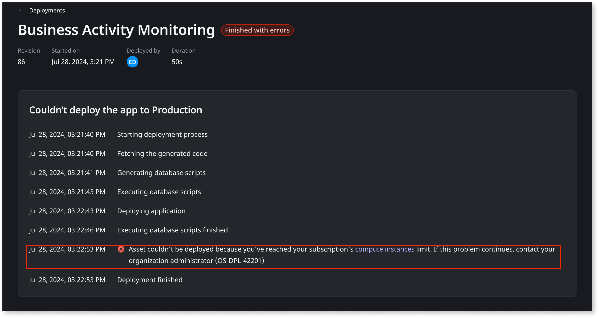
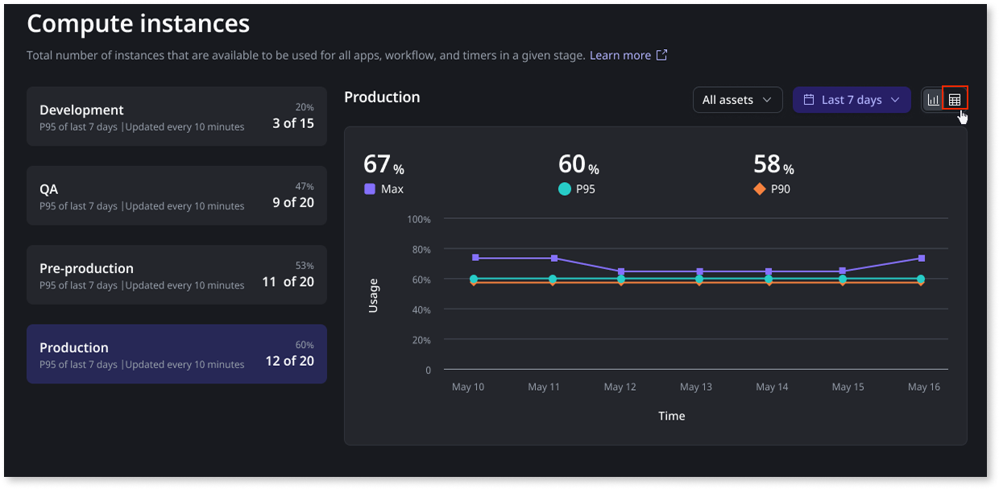
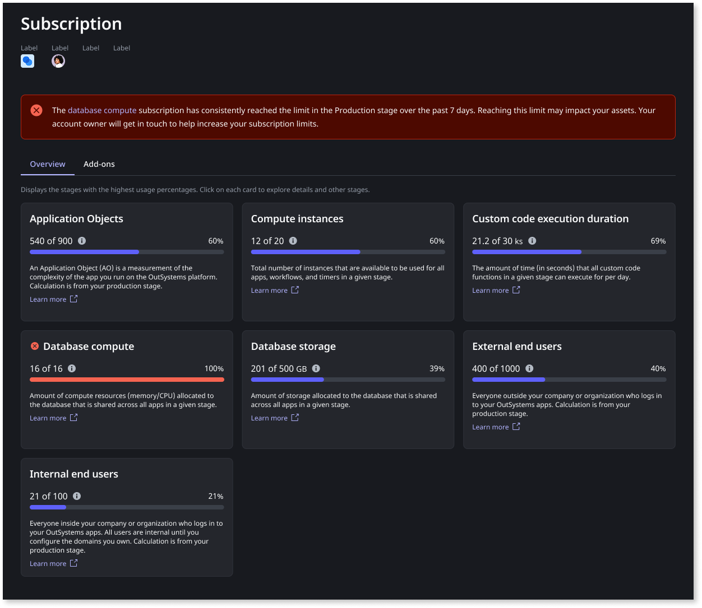

# Monitor ODC resource capacity

ODC allocates resource limits based on your subscription. These capacities define the maximum usage for each resource. 

Each stage in ODC can have a [specific capacity size](https://www.outsystems.com/es-es/evaluation-guide/scalability/architecture/#capacity-sizes). For example, the Production stage can consume more resources than the Development stage to ensure consistent performance during higher workloads.

You can use the ODC Portal to track resource consumption, understand current usage, and identify available capacity. Based on this data, you can:

* Optimize consumption: Apply best practices to ensure your apps use only the resources they need, optimizing runtime efficiency.
* Increase capacity: Contact your account team to request additional capacity.

OutSystems recommends actively [monitoring](#monitor-consumption) and [optimizing your resource usage](#optimize-consumption) to ensure consistent app performance and a seamless user experience. Use the ODC Portal to track resource consumption, understand current usage, and identify available capacity. Based on this data, you can:

## Resource limits

Each resource in ODC is subject to specific capacity limits that govern its usage within a stage. The available resources and their respective limits include:

* Compute instances: The total number of [container instances](../app-architecture/intro.md#containers) available for all apps, workflows, and timers within a stage. They define the pool size of containers that running apps can allocate or release as needed. Each app, workflow, or timer consumes at least one container when running. In subscriptions with high availability, apps consume at least two containers. Remember that multiple instances of the same workflow revision share the same resources, but different revisions may consume different resources. As demand increases, additional containers are added dynamically. When demand decreases, ODC scales down the containers accordingly. To learn more, refer to[ auto-scaling in cloud-native architecture](../manage-platform-app-lifecycle/platform-architecture/intro.md#runtime-cluster).

**Note:** 

In the development stage, ODC scales back apps to optimize resources and keep capacity sizes low. This helps maintain a cost-effective development environment.

* Custom code execution duration: Custom code execution duration is the time taken to run [custom code](../building-apps/external-logic/intro.md) from start to completion. The daily custom code execution duration is the total execution time of all custom code runs in a day. 
* Database compute: The amount of compute resources (memory/CPU) allocated to the database that is shared across all apps in a given stage.
* Database storage: The storage capacity allocated to the database, shared across all apps in a stage.

Workflows and timers consume resources only when running. 

When approaching or surpassing capacity limits, the following issues may occur:

* Compute instances: If you reach the container limit, you cannot 
  * Publish new apps
  * Update existing ones with new revisions, 
  * Run workflows and timers. 
* Custom code execution duration: Calls to custom code libraries can cause errors and fail until the next day. This can lead to runtime errors in consumer apps.
* Database compute and database storage: Apps can experience performance issues, such as slower response times or timeout errors when accessing the database if there is insufficient capacity to accommodate all of the requests.

When resource consumption is at its limit and actions that consume further resources are performed (like publishing a new app, for example), ODC displays an error. You may see these errors in ODC Studio when publishing, in ODC Portal when deploying to the next stage, or when manually running a timer. Other errors may also show at app runtime. These errors are also recorded in the [ODC logs](../monitor-and-troubleshoot/monitor-apps.md#logs).

## Monitoring resource consumption

ODC Portal helps you track resource usage trends to help you ensure that your apps maintain high performance and responsiveness during traffic spikes. 

The [subscription dashboard](../manage-platform-app-lifecycle/subscription-console.md) provides an overview of the subscribed and consumed resource limits. Select a specific resource to view each stage's resource allocation and usage details. Each stage provides additional insights into resource usage over time with the following metrics:

* Max: The highest recorded resource usage during the period.
* P95: The usage level that 95% of data points fall below, with only the top 5% exceeding this value.
* P90: The usage level that 90% of data points fall below, with only the top 10% exceeding this value.

P90 and P95 focus on sustained high usage levels while ignoring occasional spikes.

 You can analyze resource consumption in two formats:

* Graph Shows trends in resource usage over time up to the last month.
* Table: Displays compute instance consumption by different assets up to the last month.

For example, if you are using 12 out of 20 containers, the tabular view breaks down consumption by asset:

* Order status app consumes 6 containers. 
  * Daily refresh and Reset sample data timers consume 2 containers each.
  * Order status screen consumes 2 containers.
* Sample ordering app consumes 2 containers
* Order status monitoring consumes 2 containers
* Order workflow consumes 2 containers.

You can analyze **database compute** and **storage** using the usage graph. However, a tabular view is not available for these metrics.

### Managing resource consumption

ODC records resource usage over a seven day rolling period and uses P95 (95th percentile) to determine typical resource consumption. For example, if your database compute limit is 16 containers and the P95 usage remains at 14 or higher containers, you may need to scale up your resources to prevent performance issues during peak loads. 

If your usage consistently exceeds the limit over this period, ODC provides notifications in Portal to help you manage usage effectively.

Updates to resource capacity status may take time to appear in the portal, as calculations are based on P95 consumption over the last seven days. ODC displays only one error or warning at a time, prioritizing errors over warnings. Once you resolve the displayed issue, the next applicable warning or error appears if the condition still applies.

The dashboard prioritizes displaying stages with warnings or errors first rather than always showing the production stage. 

ODC alerts you when resource consumption approaches or exceeds limits:

* Warning: Displayed when you consistently use 80% or more of your resource capacity for a period of 7 days.
* Error: Displayed when you reach 100% of your resource capacity for a period of 7 days, which may impact app performance and deployment.

For example, if you have reached the limit for the number of containers, ODC displays an error notification and logs details about assets deployment failure.

## Optimize consumption

To ensure your apps don’t consume more resources than necessary, it’s important to take the most out of the subscribed resources. Make sure to:

* Apply OutSystems best practices such as [Best practices for data management](../building-apps/data/data-best-practices/intro.md) and [Best practices for logic](../building-apps/logic/best-practices-logic.md).
* Monitor [Code quality](../monitor-and-troubleshoot/manage-technical-debt/managing-tech-debt.md) to prevent common performance pitfalls.
* Leverage [ODC analytics](../monitor-and-troubleshoot/app-health.md) to identify performance improvements.
