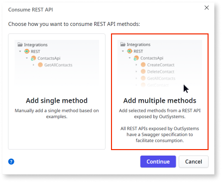
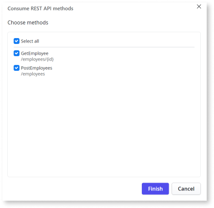
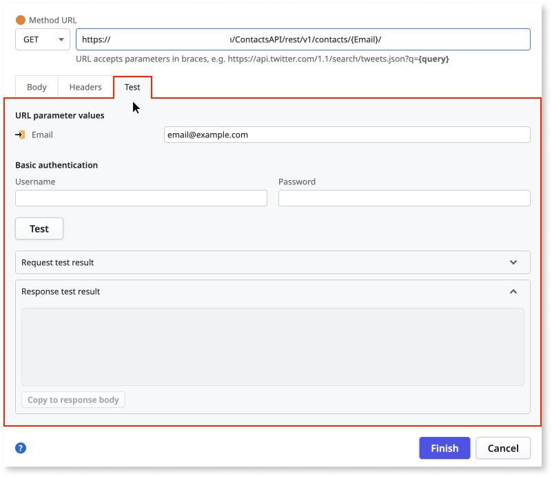
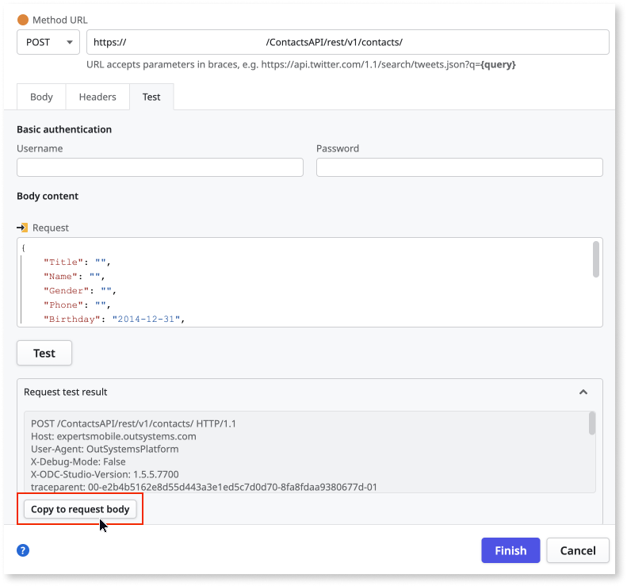
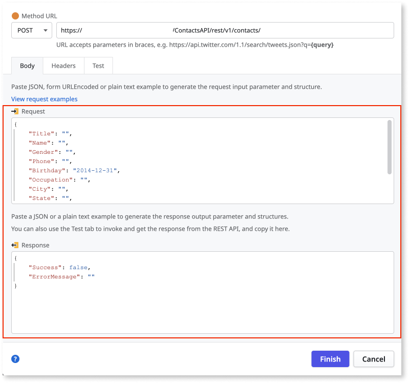
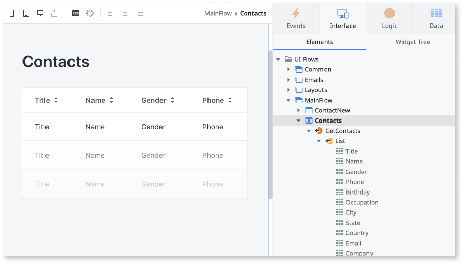

# Consume one or more REST API methods
Make sure you gather all the information you need from the REST API documentation before starting. You can also take a quick video tour about [Consuming a REST API in 10 minutes with OutSystems](https://youtu.be/gNyWIeJYfG0).

In ODC Studio you can:

* consume several REST API methods (all methods or just the methods you select) described in a Swagger specification file, provided either by entering a URL or by selecting a specification file from the local file system.

* Consume a single REST API method.

## Consume several methods of a REST API { #all-methods }

You can consume several methods of a REST API (all API methods or just the methods you select) if that API is compliant with the [Swagger specification](https://swagger.io/specification/). REST APIs exposed by OutSystems are compliant with this specification.  

You can import Swagger specifications either by providing a URL or by selecting a specification file from the local file system.

Do the following:

1. In the **Logic** tab, open the **Integrations** folder.

1. Right-click on the **REST** element and select **Consume REST API...**

    

1. In the displayed dialog, choose **Add Multiple Methods**.

    

1. If you're importing an OpenAPI 3.0 specification file and the specification includes more than one server endpoint, choose the desired endpoint and click **Next**.

    _Note:_ You can't change the server endpoint after importing the REST API.

1. Choose the REST API methods you want to import (by default, all methods) and click **Finish**.

    

When importing the REST API, ODC Studio does the following:

* Creates the REST API
* Creates REST API Methods with the corresponding input and output parameters
* Creates the Structures to hold the corresponding input and output parameters under a new tree element with the REST API name

* Maps the [REST Data Types into OutSystems Data Types](intro.md#mapping-rest-data-types-to-outsystems-data-types)

## Consume a single method of a REST API { #single-method }

In OutSystems you can consume a **single method** of a REST API, based on example content for the request and/or response. You may need to specify input parameters in the URL and/or a body for manipulation methods like `POST` or `PUT`.

Do the following:

1. In the **Logic** tab, open the **Integrations** folder.

1. Right-click on the **REST** element and select **Consume REST API...**.

    

1. In the displayed dialog, choose **Add Single Method**.

    

1. Fill the information about the **Method URL**. You can include parameters between braces in the URL for the method's input parameters.

    Examples:  
    `GET https://api.example.com/Portal/rest/Contacts/GetAll`  
    `GET https://api.example.com/Portal/rest/Contacts/Get?Id={Id}`  
    `POST https://api.example.com/Portal/rest/Contacts/Create`  

    Each input parameter defined between braces in the URL becomes an input parameter of the method.

    

    **Note:** Input parameters in URL query strings must follow a specific format. See [Using parameters in the URL query string](#using-params-query-string) for details.

    

1. If the REST API you are consuming requires specific headers or uses HTTP Basic Authentication, open the **Headers / Auth** tab and fill the necessary information.

    

1. Fill the information about the Request and the Response. The easiest way to do this is to perform a test to the API and use the test result.

    Alternatively, you can add the JSON structure or plain text example directly in the **Request** and **Response** fields in the **Body** tab. Open the **Test** tab. If you have parameters in your **Method URL**, you need to insert the parameter values to execute the test:

    

    For manipulation methods, such as `POST` or `PUT`, fill the **Request** of the Body Content with the corresponding request structure:  

    

1. Click **Test**. If the test is successful, you see the method's response in the Response area of **Test** tab.

    Use that information to fill in the Response in the **Body** tab by clicking **Copy to Response body** in the **Response** area. Leave only the needed fields.

    For manipulation methods (such as `POST` or `PUT`), do the same for the Request, by pressing **Copy to Request body** in the Request area:

    

    Usually, you obtain the most common fields this way. To know in full detail all the available fields, check the API documentation.

1. Check if the **Request** and **Response** information is correct in the **Body** tab and click **OK**:

    

When importing the REST API method, ODC Studio does the following:

* Creates a REST API element under the **REST** element in the tree
* Creates a REST API Method with the corresponding input and output parameters
* Creates the Structures to hold the corresponding input and output parameters under a new tree element with the REST API name

* Maps the [REST Data Types into OutSystems Data Types](intro.md#mapping-rest-data-types-to-outsystems-data-types)

## Use a REST API Method in your Application { #use }

OutSystems translates the methods exposed by a REST API into **OutSystems actions**, with the same semantics as any action created by you in ODC Studio.

You can now use the newly created methods in your application the same way you use any Server Action:

1. Go to the action flow where you want to use the REST API Method.
  
    

1. In the **Logic** tab, open the **Integrations** folder and the **REST** element.

1. Expand the REST API element and drag the REST API Method into your action flow.
  
    

1. Use the method's output parameters as you do for any other action.
  
    

## Using parameters in the URL query string { #using-params-query-string }

OutSystems supports using input parameters in URL query string as name/value pairs, like in `key={value}`, where `value` is an input parameter. The URL query string is the part of the URL after the `?` (question mark) character.

For example, you can use the following URLs:

* `http://apps.example.com/Orders/{id}/?show_details={ShowDetails}`

    Uses `id` outside the query string, as part of the URL.  
    Uses `ShowDetails` as the value of a query string parameter, following the allowed format (`key={value}`).

* `http://apps.example.com/Orders/?key1={value1}&key2={value2}`

    Uses `value1` and `value2` as input parameters, following the allowed format.  
    You can separate parameters in the query string using the `&` (ampersand) character.

Using input parameters in the query string following a different format, or as a way of defining the whole query string, is **not supported** in OutSystems.

For example, you can't use any of the following URLs because they're not currently supported:

* `http://apps.example.com/Orders/?{key}={value}`

    You can't use an input parameter (in this case, `key`) to define a query string parameter name.

* `http://apps.example.com/Orders/?key={value1},{value2}`

    You can't use several input parameters (in this case, `value1` and `value2`) to define a composed value for a query string parameter.

* `http://apps.example.com/Orders/?name={"last":{value1},"first":{value2}}`

    You can't use JSON structures as query string parameter values.

* `http://apps.example.com/Orders/?{QueryString}`

    You can't define a generic query string that's only defined at runtime using an input parameter.

