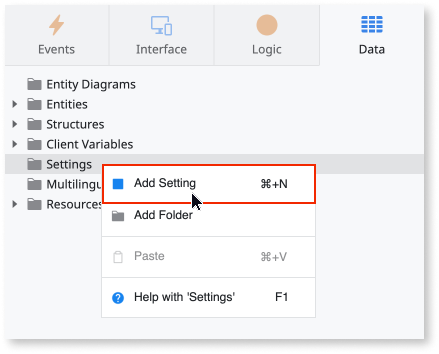
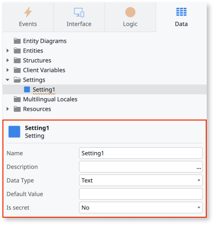
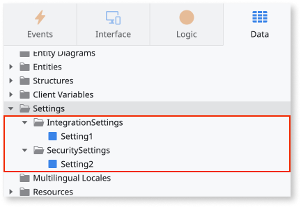
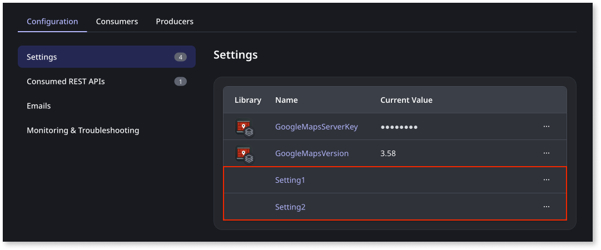

# Configure app settings

In ODC Studio, for new or existing apps in the **development stage,** you can:

* [Create or change settings](#create-or-change-settings--create-or-change-settings)

* [Organize settings into folders](#organize-settings-into-folders--organize-settings-into-folders)

* [View and edit the default values of app settings](#view-and-edit-default-values-of-the-app-settings--view-and-edit-default-values-of-the-app-settings)

# Create or change settings { #create-or-change-settings}

To create or change app settings, follow these steps:

1. Open your app in ODC Studio and go to **Data** > **Settings**.

1. To create a setting, right-click the settings folder and select **Add Setting**.

    

1. You can configure the settings from the **Properties** tab.

    

You must publish your app after you make any changes.

If you're storing sensitive information such as passwords or an access token in the setting, set the **Is secret** property to True. For more information about the **Is secret** property, refer to [Set as Secret](../security/set-as-secret.md). For more information about settings and their properties, refer to [Setting properties](#setting-properties-setting-properties).

# Organize settings into folders { #organize-settings-into-folders}

To organize your app settings into folders:

1. Right-click the **Settings** folder and select **Add folder**

1. Drag and drop each of the settings into the relevant folders.

    

# View and edit default values of the app settings { #view-and-edit-default-values-of-the-app-settings}

In the ODC Portal, you can view and edit default settings for all apps on a specific stage. To do this:

1. From the ODC Portal, select your app.

1. The **Configuration** tab displays the app settings by type, such as Settings and Emails.

1. Select **Settings**.

    The app settings are displayed. Settings inherited from libraries are also displayed.

    

1. To view the setting details, select the ellipsis and select **View**

1. To edit the setting details, select the ellipsis and select **Edit**.

1. After making your changes, click **Save**.

**Note**: The file size limit for binary data settings is 5.8KB.

Remember, settings are stage-specific.

## Setting properties {#setting-properties}

The following table shows the available settings and their properties.

| Property| Description|Mandatory|
|---|---|---|
| Name | Setting name | Yes |
| Description | Detailed description of the setting. Useful for documentation purposes. The maximum size of this property is 2000 characters. | No |
| Data Type | The settings data type.|Yes|
| Is secret | Encrypts and protects sensitive settings such as passwords and access tokens. A setting with the **Is secret** property enabled does not have a default value. |No|
| Default Value | Initial value of this setting. If undefined, the default value of the data type is used. This does not apply to settings that have the **Is secret** property enabled.|No|

## Related sources

* [Best practices for data management](../building-apps/data/data-best-practices/intro.md)

* [OutSystems Training: Settings](https://learn.outsystems.com/training/journeys/settings-370)
